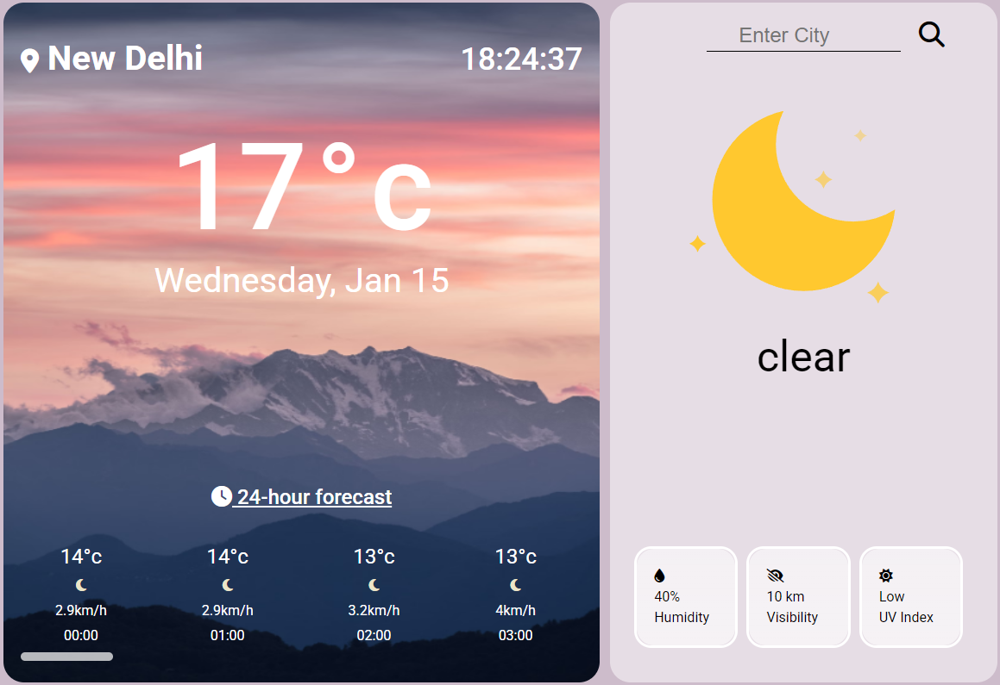

# Weather App

[Visit Site](https://harshitrajsinha.github.io/weather-app/)

Discover accurate and up-to-date weather information with this user-friendly weather app. Get real-time data on temperature, humidity, wind speed, and more, along with 24-hour forecasts to plan the day. Easily check weather conditions for any location by manually entering your city. Featuring vibrant icons and engaging Lottie animations, providing a visually dynamic experience.



## Features

- **Current Weather Information** : Displays real-time data about temperature, humidity, wind speed, and other weather conditions.
- **Forecasts** : Provides hourly forecasts (24-hours).
- **Location-based Weather** : Allows manual location input for localized weather data.

## Learning

- GraphQL API to fetch only required data from large data set.
- CSS positioning to position individual component gracefully.

## Installation

To run this project locally, follow these steps:

1. **Clone the repository**:

   ```bash
   git clone https://github.com/yourusername/weather-app.git
   ```

2. **Navigate into the project folder**:
   ```bash
   cd speed-typing
   ```
3. **Initialize npm and run**:
   ```bash
   npm init && npm run dev
   ```

## Tech Stack -

- **HTML**: For the structure of the weather app interface.
- **CSS**: For styling the elements and ensuring responsiveness.
- **JavaScript**: To handle dynamic weather information of different location and its related data.
- **GraphQL** : Fetching necessary data from plethora of data points, avoiding over-fetching.
